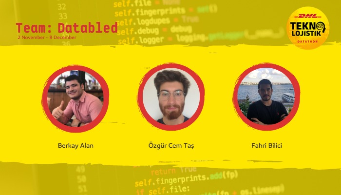

# DHL-Datathon

DHL Technologistik Datathon

Lojistik ve tedarik zinciri sektörlerinin temeli büyük verilerden oluşmaktadır. Günümüzde yapılan çalışmalarla, lojistik ve tedarik zinciri sektörünün robotik ve otomasyon bacağında bir doyum noktasına ulaştığı görülmüştür.
Analizler sonucunda, lojistik ve tedarik zinciri sektörünü bir adım ileriye taşıyacak teknoloji yatırımının, büyük veri ve yapay zeka algoritmaları üzerine olacağı ortaya çıkmıştır.

Bu sebeple 2021 yılı içerisinde 3.’sünü gerçekleşecek Teknolojistik yarışması, Datathon konsepti ile devam ederek; Makine Öğrenimi, Büyük Veri ve Yapay Zeka algoritmaları ile gelişen teknolojide bir adım önde olma imkanı
sağlayacaktır.

## Let us introduce our amazing team: Databled

## Connect with our Team : Databled

- [Berkay Alan](https://www.linkedin.com/in/berkayalan/)
- [Mehmet Fahri Bilici](https://www.linkedin.com/in/mehmetfahribilici/)
- [Özgür Cem Taş](https://www.linkedin.com/in/ozgur-cem-tas-437bb0155/)
